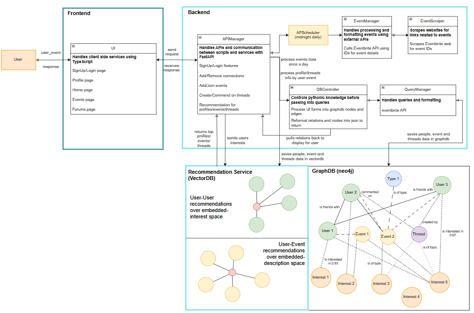
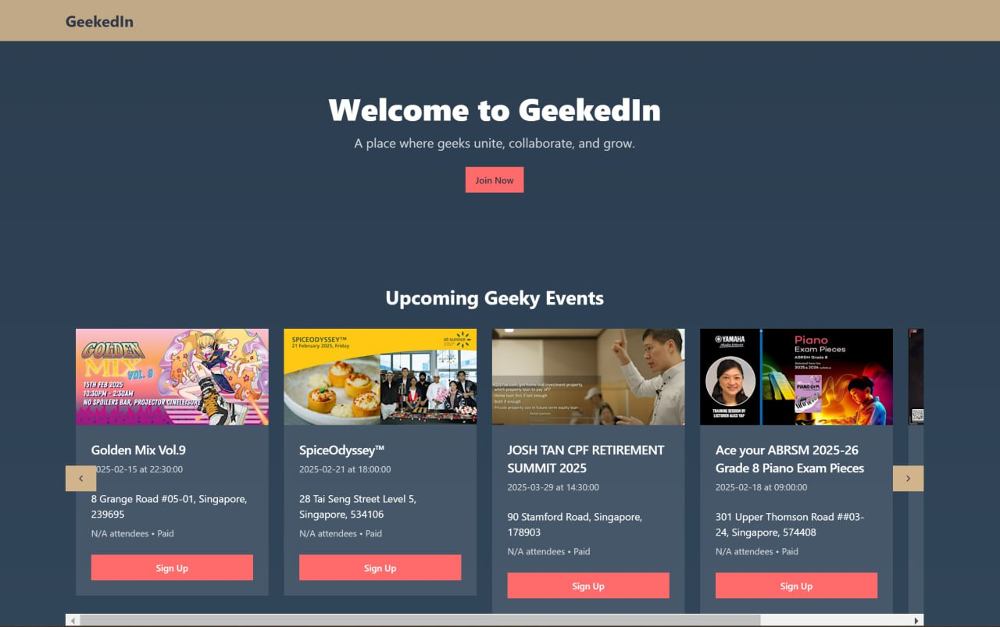
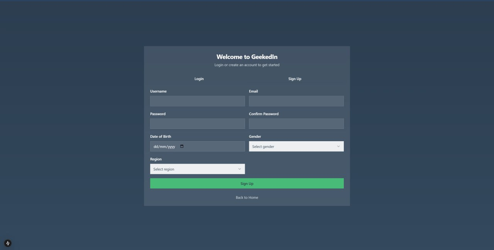
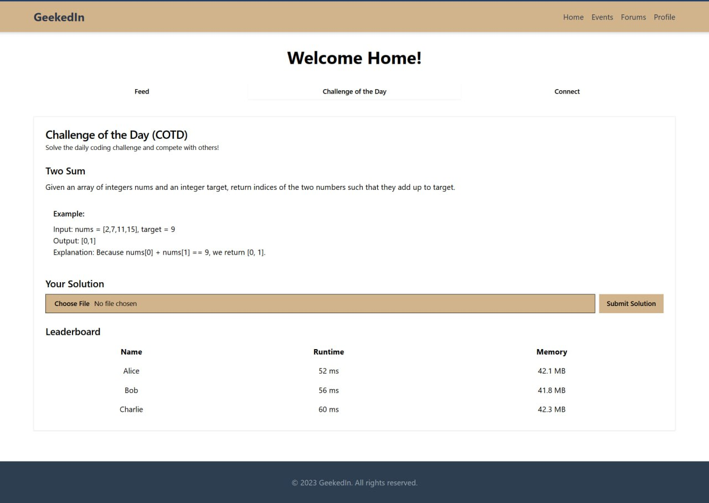
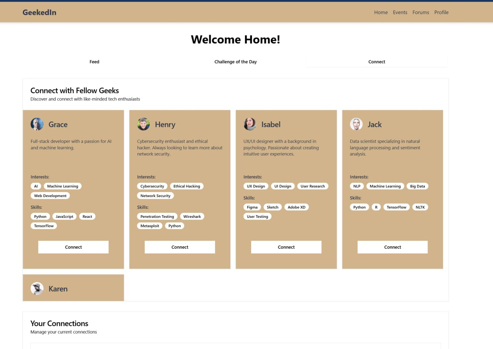
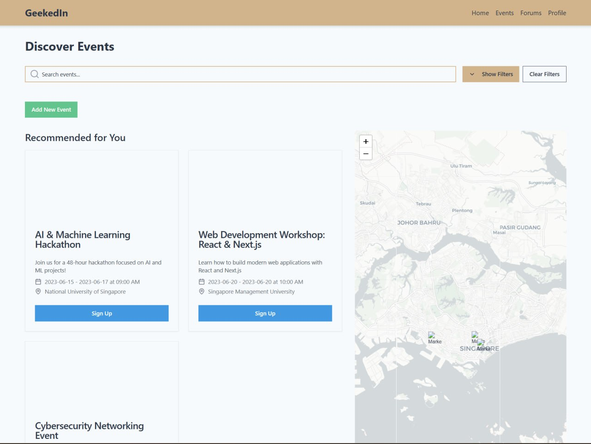
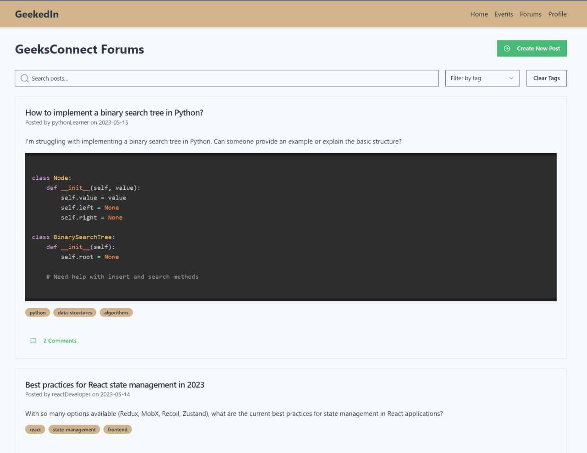
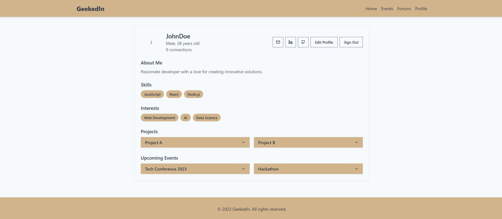

# **GeekedIn** - **Connecting Geeks, Fostering Collaboration**
## HackOMania 2025 - Product of Team Perchance

## **Overview**
This project was developed during the **HackOMania 2025 Hackathon organised by GeeksHacking**. Out of 3 problem statements, we chose to tackle the **'Geek Connect: Find Your Tribe IRL'** challenge, where participants were invited to _build a platform that fosteres real-world connections within the Geek community_.

**GeekedIn** is a platform designed to help geeks connect based on their interests, enabling collaboration, in-person interactions, and event discovery. It focuses on being an all-in-one platform that adopts and integrates the best features of other websites, including a community forum page, challenges of the day, event finder with an interactive map and so on. It also goes beyond simple networking by modeling deep relationships between people, events, and products, powered by a custom recommendation algorithm that leverages similarity search.

### **Key Features**  
✅ **Dynamic UI** – Built with TypeScript and deployed on Node.js, featuring four main interactive pages:  
- 🏠 **Main Page** – Discover posts by fellow geeks, compete to complete daily challenges or connect with similar geeks
- 📅 **Events** – Find local meetups and tech gatherings organised by organisations or fellow geeks
- 💬 **Forums** – Engage in geeky discussions, seek guidance or share ideas with one another
- 👤 **Profile** – Customize and manage your personal geek profile, sharing your projects, events, skills and aspirations

✅ **Graph-Based Backend** – Neo4j serves as the core database, storing:    
- ❗️ **Interests** – Main nodes that are linked to almost all other nodes and affect recommendation
- 👥 **Users** – Modeled as nodes with profile information and linked to interests
- 🎟️ **Events** – Event nodes linked to users and interest categories  
- 💬 **Forums** – Thread/forum nodes with comments, linked to users and interest categories    
- 🔗 **Relationships** – Mapped between users, events, threads/forums and shared interests  

✅ **Automated Event Updates** – EventManager service syncs with websites using webscraping and website APIs
- Webscraping is done to extract event ids from websites like Eventbrite (relevant Eventbrite API for this is deprecated)
- **Eventbrite API** (with event ids) is used to pull relevant information of events (name, location, datetime, cost, categories etc)
- Neo4j DB and VectorDB get updated after data is processed
- Only runs once a day using **APScheduler** due to long processing time

✅ **AI-Powered Recommendations** – A Chroma Vector DB and Deepseek-R1 collaboration
- **Chroma Vector DB** stores latent representations of users and events each time it is created
- Following user events, the recommendation system takes the user's profile (age, gender, interests etc) and plugs it into **Deepseek-R1**
- Deepseek returns a description of the type of events/profiles the user most likely inteact with
- Description is vectorized and put into vector space to complete **cosine similarity search** for recommended events/profiles

## **Architecture**
GeekedIn follows a **microservices-based** architecture with three core services:
1. **Frontend (UI Service)** – TypeScript, Node.js, interactive map feature
2. **Backend Service** – FastAPI with Neo4j for storing and managing relationships
3. **Recommendation Engine** – Chroma for similarity search-based recommendations using Deepseek analysis



## **Deployment Instructions**
To set up and run GeekedIn, follow these steps:

### **1. Clone the Repository**
```bash
git clone https://github.com/cvu-opensource/Hackomania2025.git
cd Hackomania2025
```

### **2. Backend Setup**
Ensure you have Python installed, then:
```bash
cd backend
python -m venv venv
venv\Scripts\activate  # On Windows
source venv/bin/activate  # On macOS/Linux
pip install -r requirements.txt
backend.bat  # Start the FastAPI backend
```

### **3. Frontend Setup**
Ensure Node.js and npm are installed, then:
```bash
cd frontend
npm install
npm run  # Starts the frontend service
```

### **4. Recommendation Service Setup**
Ensure Docker is installed, then:
```bash
cd vector_db
docker build .
docker run -d -p 127.0.0.1:8001 <image id>
```

---

## **UI Showcase**  
### **Homepage**  



### **Main Page**  




### **Events Page**   


### **Forums Page**   


### **Profile Page**  
 

---

## **Future Enhancements**  
🚀 **Potential future improvements include:**  
- 🔎 **Continue implementing thread and comment recommendations** to enhance forum engagement  
- 📝 **Optimized recommendation algorithms** refined via user feedback over time
- 📈 **Better Graph based search** to aid recommendations
- 🏆 **Gamification** of user interactions/contributions 
- 🏳️ **Clans/Tribes** for users to join (of varying capacities) for closer relationships

---

### Contributors

| Name            | Tasks                          | GitHub Profile                        | LinkedIn Profile                       |
|-----------------|-------------------------------|---------------------------------------|----------------------------------------|
| **Gerard Lum**   | API Manager, UI      | [https://github.com/gerardlke](https://github.com/gerardlke) | [https://www.linkedin.com/in/gerardlumkaien/](https://www.linkedin.com/in/gerardlumkaien/) |
| **Benjamin Goh** | Recommendation service   | [https://github.com/checkpoint214159](https://github.com/checkpoint214159) | [https://www.linkedin.com/in/benjamin-goh-45a0a7307/](https://www.linkedin.com/in/benjamin-goh-45a0a7307/) |
| **Yeo You Ming**   | UI, Events Manager  | [https://github.com/Forfeit-15](https://github.com/Forfeit-15) | [https://www.linkedin.com/in/yeo-you-ming-5b10852aa/](https://www.linkedin.com/in/yeo-you-ming-5b10852aa/) |
| **Jordan Ng**    | Neo4j, DB Management | [https://github.com/ngjsjordan](https://github.com/ngjsjordan) | [https://www.linkedin.com/in/jordan-ng-882740347/](https://www.linkedin.com/in/jordan-ng-882740347/) |
